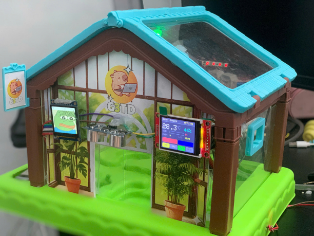
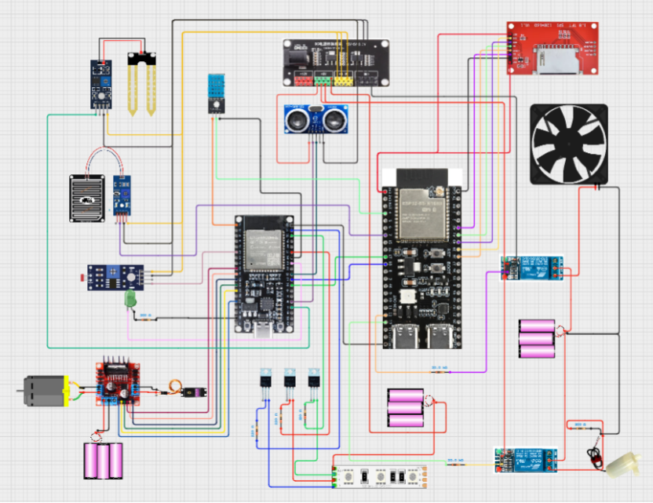
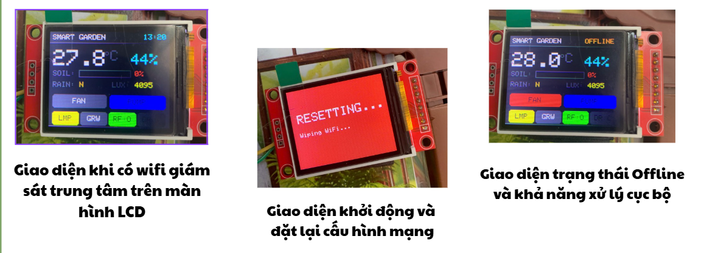
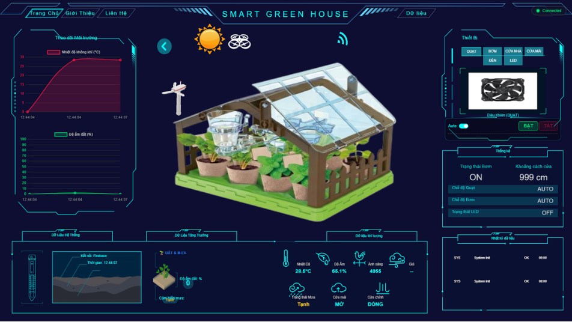
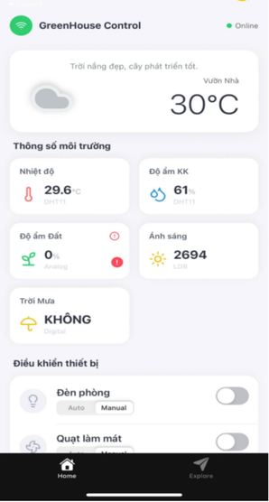

# 🌱 NÔNG TRẠI KÍNH THÔNG MINH IOT (SMART GREENHOUSE IOT)

> **Học phần: Hệ Thống Nhúng Thông Minh và IoT**  
> **Nhóm thực hiện: G3TD**

---

## 👥 Thành viên nhóm thực hiện (G3TD)

| STT | Họ và Tên | MSSV | Lớp |
| :---: | :--- | :---: | :---: |
| 1 | **Võ Duy Toàn** | `2200002076` | 22BITV01 |
| 2 | **Nguyễn Thị Huyền Diệu** | `2200001765` | 22BITV03 |
| 3 | **Phan Minh Thuận** | `2200010286` | 22BITV03 |
| 4 | **Nguyễn Văn Thuận** | `2200009501` | 22BITV03 |

---

## 📌 Giới thiệu tổng quan

Đề tài **"Thiết kế và xây dựng hệ thống quản lý nông trại rau nhà kính thông minh ứng dụng IoT"** hướng tới giải pháp tự động hóa toàn diện trong nông nghiệp công nghệ cao 4.0:

- **Tự động hóa vi khí hậu:** Tự động tưới tiêu theo độ ẩm đất, quạt tản nhiệt làm mát theo nhiệt độ môi trường, tự động đóng mái vòm khi phát hiện trời mưa và bổ sung ánh sáng quang hợp nhân tạo cho rau.
- **Tiết kiệm tài nguyên:** Tiết kiệm 70 - 90% lượng nước tưới, giảm hơn 80% công vận hành thủ công so với nông nghiệp truyền thống.
- **Giám sát đa kênh thời gian thực:** Màn hình màu LCD/TFT trực tiếp tại hiện trường, giao diện Web Dashboard 3D mô phỏng và ứng dụng di động Mobile App.
- **Tương tác AI bằng giọng nói:** Tích hợp giao thức MCP (Model Context Protocol) với trợ lý ảo Xiaozhi AI để điều khiển trực tiếp hệ thống nhúng bằng ngôn ngữ tự nhiên.

---

## 1. Mô hình thực tế

Mô hình nhà kính thu nhỏ (Prototype) hoàn chỉnh với đầy đủ phân khu canh tác giá thể, hệ thống cảm biến môi trường và các thiết bị chấp hành tự động:



---

## 2. Kiến trúc hệ thống

Hệ thống nhúng được thiết kế theo mô hình phân tán **Master - Slave**, giao tiếp nối tiếp có dây (UART) thông qua các gói tin định dạng JSON chuẩn hóa:


### 🔹 Node Master (`ESP32-S3 N16R8`)
- **Cấu hình:** Chip Dual-core LX7, 16MB Flash, 8MB PSRAM, tích hợp Wi-Fi 2.4GHz & Bluetooth LE.
- **Nhiệm vụ:**
  - Kết nối Internet, đồng bộ 2 chiều dữ liệu thời gian thực với **Google Firebase Realtime Database**.
  - Hiển thị thông số và trạng thái hệ thống lên màn hình màu TFT thông qua giao tiếp SPI.
  - Đọc cảm biến nhiệt độ & độ ẩm không khí **DHT11**, cảm biến mưa **Rain Sensor**.
  - Điều khiển đóng/ngắt quạt thông gió 12V và máy bơm mini 5V qua module Relay.
  - Giao tiếp hai chiều với Slave qua UART: truyền lệnh điều khiển và nhận dữ liệu cảm biến đóng gói JSON.

### 🔹 Node Slave (`ESP32 WROOM-32`)
- **Nhiệm vụ:**
  - Thu thập liên tục tín hiệu từ cảm biến độ ẩm đất **YL-69**, quang trở **LDR**, cảm biến siêu âm **HY-SRF05**.
  - Áp dụng giải thuật lọc trung vị (**Median Filter**) loại bỏ nhiễu trước khi đóng gói JSON gửi về Master.
  - Điều khiển động cơ đảo chiều đóng/mở cửa và mái che vòm thông qua module công suất **L298N**.
  - Điều khiển dải đèn quang phổ **12V RGB LED Strip** đổi màu bằng xung PWM qua MOSFET công suất **IRLZ44N**.
  - **Cơ chế an toàn (Fail-safe):** Tự động ngắt điện động cơ nếu thời gian quay vượt ngưỡng định trước để chống kẹt cơ khí và bảo vệ phần cứng.

---

## 3. Sơ đồ nối dây chi tiết

Sơ đồ nguyên lý kết nối chi tiết giữa các chân GPIO của vi điều khiển ESP32-S3, ESP32 Slave, cảm biến, mạch driver động cơ, relay và khối nguồn pin 18650 qua bộ hạ áp Buck Converter:



### Bảng phân bổ linh kiện chính

| Linh kiện | Thông số kỹ thuật | Vai trò trong hệ thống |
| :--- | :--- | :--- |
| **ESP32-S3 N16R8** | Dual-core, 16MB Flash, 8MB PSRAM | Master Node: Điều phối trung tâm, Wi-Fi, TFT |
| **ESP32 WROOM-32** | 32-bit MCU, đa kênh ADC & PWM | Slave Node: Đọc cảm biến phụ, lái động cơ & LED |
| **DHT11** | $0 - 50^{\circ}\text{C}$ ($\pm2^{\circ}\text{C}$), $20 - 90\%\text{ RH}$ | Giám sát nhiệt độ và độ ẩm không khí |
| **YL-69** | Đầu dò đất hai chân + Op-Amp LM393 | Đo độ ẩm đất để tự động tưới tiêu |
| **Rain Sensor Module** | Bề mặt mạ niken dẫn điện, Analog/Digital | Phát hiện trời mưa để đóng mái che vòm |
| **HY-SRF05** | Khoảng cách $2\text{cm} - 4.5\text{m}$, sai số $\sim 3\text{mm}$ | Cảm biến khoảng cách mở cửa tự động |
| **Quang trở (LDR)** | Cảm biến ánh sáng + LM393 | Đo cường độ ánh sáng môi trường |
| **Màn hình TFT LCD** | 1.8 inch SPI RGB | Hiển thị thông số và trạng thái tại chỗ |
| **Driver L298N** | IC cầu H kép, tải tối đa $2\text{A}$/kênh | Điều khiển chiều quay và tốc độ động cơ DC |
| **MOSFET IRLZ44N** | Logic-level N-Channel, $55\text{V} - 47\text{A}$ | Đóng ngắt PWM dải đèn LED RGB 12V |
| **Module Relay 5V** | Cách ly quang Optocoupler, chịu tải $250\text{V}/10\text{A}$ | Bật/tắt bơm mini 5V và quạt tản nhiệt 12V |
| **Pin Cell 18650 & Buck** | Khối cell pin + mạch hạ áp DC-DC | Cung cấp nguồn 5V và 12V độc lập |

---

## 4. Giám sát tại chỗ (LCD)

Màn hình TFT LCD trực quan trên mô hình, hỗ trợ hiển thị đa trạng thái:



- **Giao diện khi có WiFi:** Đồng bộ thời gian thực NTP (`13:20`), hiển thị nhiệt độ ($27.8^{\circ}\text{C}$), độ ẩm ($44\%$), độ ẩm đất, cường độ sáng (`4095 lux`) cùng trạng thái quạt (`FAN`), đèn (`LMP`, `GRW`), mái che (`RF:O`).
- **Giao diện khi mất mạng (Offline):** Hiển thị cảnh báo `OFFLINE`, hệ thống tự động chuyển sang chế độ điều khiển cục bộ độc lập dựa trên các ngưỡng cài đặt sẵn.
- **Giao diện đặt lại cấu hình mạng:** Màn hình đỏ cảnh báo `RESETTING... Wiping WiFi...`, xóa thông tin mạng cũ khỏi Flash và khởi chạy điểm phát sóng SoftAP để cấu hình WiFi mới.

---

## 5. Web Dashboard & Mobile App

Hệ thống cho phép giám sát và điều khiển tức thời trên cả máy tính lẫn thiết bị di động:

| Web Dashboard | Mobile App |
| :---: | :---: |
|  |  |

### 🌐 Tính năng chính trên Web Dashboard
- **Mô hình phối cảnh 3D:** Tương tác trực quan mô phỏng thời tiết nắng/mưa, trạng thái mở/đóng của mái che và cửa.
- **Biểu đồ thời gian thực (Chart.js):** Theo dõi liên tục biến thiên nhiệt độ và độ ẩm theo dòng thời gian.
- **Bảng điều khiển (Control Panel):** Bật/tắt và chọn chế độ Auto/Manual cho quạt làm mát, máy bơm tưới, đèn phòng, mái vòm và cửa ra vào.
- **Bộ chọn màu LED RGB:** Điều chỉnh dải màu Hex tùy biến cho đèn chiếu sáng quang hợp.
- **Báo cáo lịch sử (Data Logging):** Lọc và xuất dữ liệu cảm biến theo từng ngày cụ thể.

### 📱 Ứng dụng di động (React Native)
- Kết nối Firebase Realtime Database qua Firebase SDK với độ trễ phản hồi $< 1\text{s}$.
- Thiết kế giao diện Card-UI tối ưu cho thao tác chạm và vuốt trên điện thoại.
- Hoạt động từ xa ở mọi nơi qua Internet mà không cần cấu hình NAT Port hay IP tĩnh.

---

## ☁️ Cấu trúc dữ liệu Firebase Realtime Database

```
greenhouseg3td-default-rtdb
└── greenhouse
    ├── controls/               <-- Lệnh điều khiển gửi từ Web / Mobile App
    │   ├── door: "close"       // "open", "close", "auto"
    │   ├── fan: "auto"         // "on", "off", "auto"
    │   ├── grow: "on"          // "on", "off"
    │   ├── grow_color: "FF00FF"// Mã màu HEX đèn LED
    │   ├── grow_mode: "manual" // "auto", "manual"
    │   ├── pump: "off"         // "on", "off", "auto"
    │   └── roof: "open"        // "open", "close", "auto"
    │
    ├── live_data/              <-- Dữ liệu thời gian thực từ ESP32 gửi lên
    │   ├── modes/
    │   │   ├── fan_mode: "AUTO"
    │   │   └── pump_mode: "MANUAL"
    │   ├── sensors/
    │   │   ├── door_distance: 150   // Khoảng cách siêu âm (cm)
    │   │   ├── humidity: 65         // Độ ẩm không khí (%)
    │   │   ├── soil_moisture: 42    // Độ ẩm đất (%)
    │   │   ├── temperature: 31.5    // Nhiệt độ không khí (°C)
    │   │   └── rain_detected: false // Có mưa hay không (true/false)
    │   └── status/
    │       ├── fan: "OFF"           // Trạng thái quạt
    │       ├── pump: "ON"           // Trạng thái máy bơm
    │       ├── door: "CLOSED"       // Trạng thái cửa
    │       └── roof: "OPEN"         // Trạng thái mái vòm
    │
    └── history/                <-- Dữ liệu lưu vết vẽ đồ thị
        └── -Njk89s8d7s...
            ├── temp: 30.5
            ├── humi: 60
            └── ts: 1704528000       // Unix Timestamp
```

---

## 🤖 Điều khiển giọng nói AI qua Model Context Protocol (MCP)

Dự án tích hợp giao thức MCP với trợ lý ảo **Xiaozhi AI** thông qua kênh truyền WebSocket bảo mật (`wss://api.xiaozhi.me/mcp/?token=...`):

- `read_data`: Cho phép AI đọc thông số môi trường hiện tại để trả lời câu hỏi của người dùng.
- `fan_control`, `pump_control`: Điều khiển quạt tản nhiệt và máy bơm tưới tiêu theo khẩu lệnh.
- `roof_control`, `door_control`: Đóng/mở mái vòm che mưa và cửa nhà kính.
- `room_light_control`, `grow_light_control`: Bật/tắt đèn chiếu sáng và tùy chỉnh màu sắc quang hợp.

---

## 📁 Cấu trúc thư mục dự án

```text
Greenhouse_IOT/
├── backend/            # Mã nguồn backend & xử lý dữ liệu
├── frontend/           # Mã nguồn Web Dashboard (HTML5, TailwindCSS, Chart.js)
├── img/                # Thư mục hình ảnh minh họa cho tài liệu
│   ├── anhdesktop.png
│   ├── anhfollowlcd.png
│   ├── anhketquathucte.png
│   ├── mobile.png
│   ├── sơ đồ kiến trúc.png
│   └── sodoketnoi.png
├── README.md           # Tài liệu hướng dẫn dự án
└── G3TD.pdf            # Báo cáo kỹ thuật đồ án G3TD
```